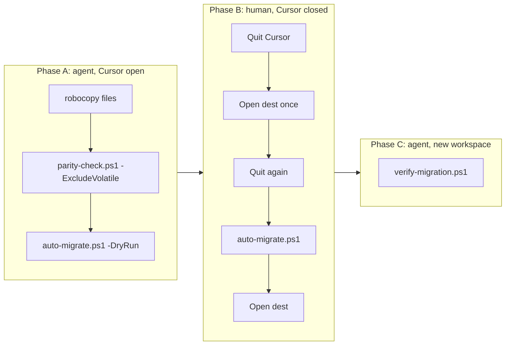

# Runbook: agent-assisted workspace migration (case study)

Move a Cursor project folder to a new path **without losing Agent/Composer chats, thread titles, or agent transcripts**.

Based on a real migration (June 2026): `C:\Users\YOU\Downloads\OldProject` → `C:\Users\YOU\Desktop\Projects\MyProject` (962 files, 211 MB, 9 named chat threads, 8 transcript files).

## Why three phases?

Cursor stores project data in **four layers**. Copying files alone is not enough.

| Layer | Location | What breaks if skipped |
|-------|----------|------------------------|
| 1. Project files | Your folder on disk | N/A (you copy this) |
| 2. Agent transcripts | `%USERPROFILE%\.cursor\projects\<slug>\` | Missing transcript files |
| 3. Chat sidebar | `%APPDATA%\Cursor\User\workspaceStorage\<hash>\` | Empty sidebar |
| 4. Thread titles & binding | `globalStorage\state.vscdb` → `composer.composerHeaders` | "New Agent" tabs, wrong titles |

**Hard constraint:** `state.vscdb` is locked while Cursor runs. Chat remapping **must** happen with Cursor fully quit.



---

## Phase A — agent (Cursor may be open)

### A1. Copy project files

```powershell
$src = "C:\Users\YOU\Downloads\OldProject"
$dst = "C:\Users\YOU\Desktop\Projects\MyProject"
robocopy $src $dst /E /COPY:DAT /DCOPY:DAT /R:2 /W:2
```

**Robocopy exit codes:** codes **0–7 are success**. Code **1** means "files copied successfully" (not an error).

### A2. Verify file parity

```powershell
.\scripts\parity-check.ps1 -Source $src -Dest $dst -ExcludeVolatile
```

Expected: `PASS: N files, sha256+size match 100%`

`-ExcludeVolatile` skips `.cursor/plans/` and `*.plan.md` — live planning artifacts that change during agent sessions (see [False positives](#known-false-positives) below).

### A3. Dry-run metadata migration

```powershell
.\scripts\auto-migrate.ps1 -Source $src -Destination $dst -DryRun
```

Expected output includes:
- `old workspace hash: <32-hex>`
- `old project slug: c-Users-YOU-Downloads-OldProject`
- `new project slug: c-Users-YOU-Desktop-Projects-MyProject` (predicted)
- `threads on old workspace: N`
- `ERROR: new workspace hash not found` — **normal at this stage** (destination not opened yet)

---

## Phase B — human (Cursor must be closed)

### B1. Quit Cursor

1. **File → Exit** (not just closing the window)
2. Wait 5 seconds
3. Confirm no `Cursor.exe` in Task Manager

### B2. Open destination once (creates workspace hash)

1. Launch Cursor
2. **File → Open Folder** → `C:\Users\YOU\Desktop\Projects\MyProject`
3. Wait for sidebar to load
4. **File → Exit** again

### B3. Run metadata migration

```powershell
.\scripts\auto-migrate.ps1 -Source $src -Destination $dst
```

Expected:
```
old workspace hash: <old-hash>
new workspace hash: <new-hash>
threads on old workspace: 9 (ghosts: 1, named: 8)
...
remapped: 9, ghosts removed: 2, headers total: ...
Threads bound to new workspace: 9
MIGRATION COMPLETE.
```

### B4. Open destination and verify visually

1. Launch Cursor → open `MyProject`
2. Chat sidebar should show previous threads with correct titles (not blank "New Agent")

---

## Phase C — agent (new workspace)

```powershell
.\scripts\verify-migration.ps1 -Source $src -Destination $dst
```

Expected: `CONFIDENCE: 100% - all hard checks PASS`

### Confidence rubric

| Check | Hard/Soft | Pass criteria |
|-------|-----------|---------------|
| File parity (volatile excluded) | Hard | sha256+size match |
| workspaceStorage hash exists | Hard | new hash found |
| state.vscdb exists | Hard | file present |
| workspace.json → dest | Hard | URI matches destination |
| Named threads on new ws > 0 | Hard | count > 0 |
| Threads migrated (new named >= old) | Hard | no thread loss |
| MOVE proof: old ws named = 0 | Hard | clean move, no duplicates |
| Ghost threads = 1 | **Soft** | benign fresh "New Chat" tab |
| Agent transcripts new >= old | Hard | recursive file count |
| Top-level structure match | Hard | all source items in dest |

---

## Slug derivation rules

Cursor derives project slugs from absolute paths:

| Path fragment | Slug fragment |
|---------------|---------------|
| `C:\` | `c-` |
| `\` | `-` |
| spaces | `-` |
| `(51)` | `51` (parens removed) |
| `ł` (non-ASCII) | `-` (`Własne` → `W-asne`) |
| `--` | collapsed to `-` |

Example: `C:\Work\Projekt_Główny\MyApp` → `c-Work-Projekt-G-ówny-MyApp`

If auto-detection fails, run `scripts/find-workspace-hash.ps1` and check `%USERPROFILE%\.cursor\projects\` manually.

---

## Known false positives

### 1. Parity FAIL on `.cursor/plans/*.plan.md`

**Symptom:** `verify-migration` or `parity-check` reports 1 hash mismatch on a plan file.

**Cause:** Agent planning sessions edit `.cursor/plans/` in the source workspace while migration runs. The file is a live artifact, not project data.

**Verdict:** Benign. Re-run `parity-check.ps1 -ExcludeVolatile` (default in `verify-migration.ps1`).

### 2. Ghost thread count = 1 after reopen

**Symptom:** `ghosts=1` on the new workspace.

**Cause:** Cursor creates a fresh unnamed "New Chat" tab when you open the destination folder. This is normal post-open behavior, not a broken/orphaned thread.

**Verdict:** Benign (soft check). All named threads should have titles and match transcript count.

---

## Rollback

Keep source folder and backups until you confirm the migration:

| Asset | Location |
|-------|----------|
| Source folder | Original path (untouched if you copied) |
| Global DB backup | `globalStorage\state.vscdb.bak-meta-<timestamp>` |
| Workspace backup | `workspaceStorage\<hash>.bak-meta-<timestamp>` |
| Slug backup | `.cursor\projects\<slug>.bak-<timestamp>` |

To rollback: restore backups, re-open the **source** folder in Cursor.

---

## Post-migration (optional)

- Re-index semantic search — indexes are per absolute path: see [INDEXING.md](INDEXING.md)
- After a week of verification, delete source folder and old `workspaceStorage` hash
- Use the `workspace-migrator` subagent or `cursor-workspace-migration` skill for future moves

## Reference: case study results

| Metric | Value |
|--------|-------|
| Files copied | 962 (211 MB) |
| Named threads migrated | 9 |
| Ghosts removed during remap | 2 |
| Transcript files | 8 (recursive count) |
| Old workspace after MOVE | 0 named threads |
| Verification | 100% hard checks PASS |
